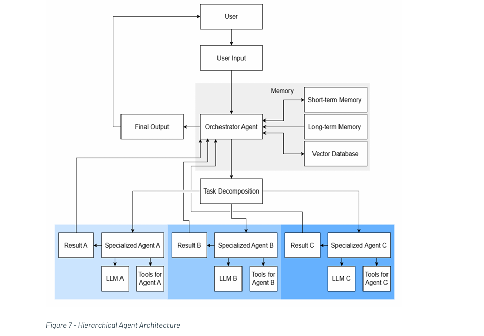

# 🎯 Hierarchical Agent Architecture / Role-Based Multi-Agent Systems

> Orchestrated specialization through coordinated multi-agent collaboration

## Overview

An orchestrator agent breaks down complex tasks and distributes them to specialized sub-agents. Each agent handles a specific domain using appropriate tools, with the orchestrator managing the overall process and integrating results.

This is a more complex pattern with specialized sub-agents coordinated by a central orchestrator.

---

## 🏗️ Architecture Components

| Component | Implementation | Description |
|:----------|:--------------|:------------|
| **Brain** | **KC1.1** - Large Language Models (LLMs) **KC1.2** - Multimodal LLMs (MLLMs) | Multiple specialized LLMs or fine-tuned models, each optimized for specific domains or tasks |
| **Control** | **KC2.2** - Hierarchical Planning | Central orchestrator (router) that decomposes complex tasks and routes sub-tasks to specialized agents |
| **Reasoning** | **KC3.1** - Structured Planning/Execution | Formal task decomposition with defined action sequences and systematic execution |
| **Memory** | **KC4.2** - Cross-agent session memory | Shared memory across multiple agents within a single session |
| **Tools** | **KC5.2** - Managed Platforms/Services | Vendor-provided solutions that simplify setup and manage infrastructure |
| **Environment** | **KC6.2** - Code Execution **KC6.4** - Web Access Capabilities | More extensive capabilities including code execution and web browsing |

---

## 📊 Architecture Diagram

