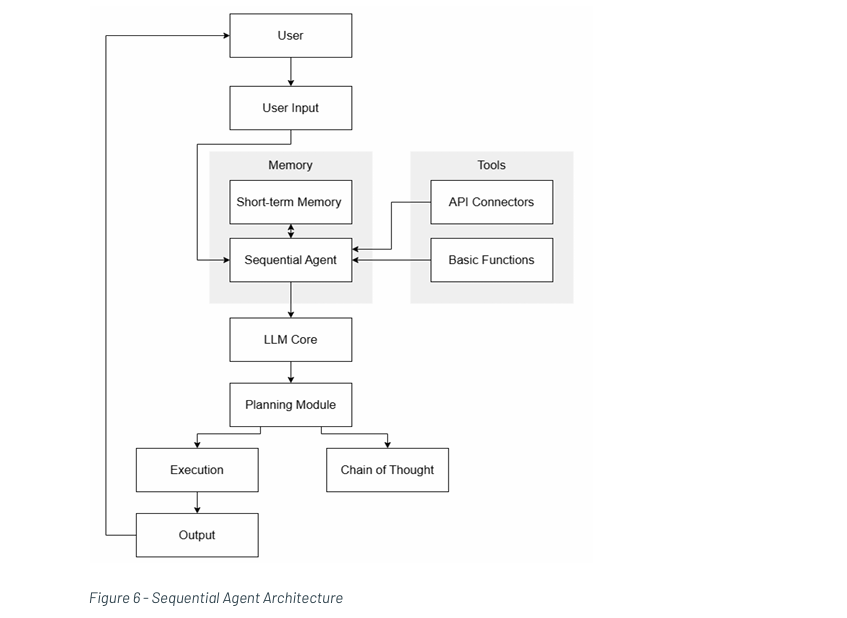

# 🔄 Sequential Agent Architecture

> A straightforward linear workflow for single-agent systems

## Overview

A straightforward linear workflow where a single agent processes input through planning, execution, and basic tool use. This pattern focuses on simplicity with a clear chain of thought and limited memory.

This basic pattern uses a single LLM as the cognitive core with a linear workflow.

---

## 🏗️ Architecture Components

| Component | Implementation | Description |
|:----------|:--------------|:------------|
| **Brain** | **KC1.1** - Large Language Models (LLMs) | Single LLM serves as the cognitive core for reasoning and generation |
| **Control** | **KC2.1** - Workflows | Simple sequential workflow with pre-defined task sequences |
| **Reasoning** | **KC3.3** - Chain of Thought (CoT) | Step-by-step reasoning process before arriving at conclusions |
| **Memory** | **KC4.1** - In-agent session memory | Memory limited to single agent, single session scope |
| **Tools** | **KC5.1** - Flexible Libraries/SDK Features | Limited SDK integration for tool access |
| **Environment** | **KC6.1.1** - Limited API Access | Restricted API access with predefined parameters |

---

## 📊 Architecture Diagram

